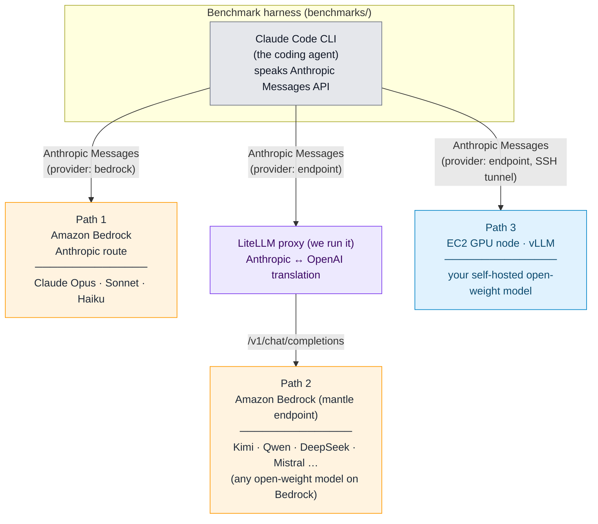
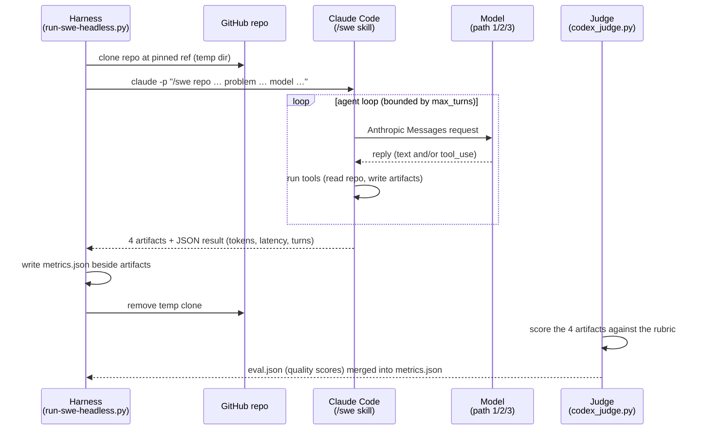

# Claude Code Multi-Model

[](LICENSE)
[](https://docs.aws.amazon.com/bedrock/latest/userguide/models-endpoint-availability.html)
[](./)

> **This is sample code intended for demonstration and learning purposes only.**
> It is not meant for production use. Review and harden all scripts, configurations,
> and IAM permissions before using in any production or sensitive environment.

## Overview

This repository is a **benchmark and harness for measuring how well different LLMs perform real-world software-engineering tasks** when driven by a coding agent. The coding agent is [Claude Code](https://docs.anthropic.com/en/docs/claude-code), Anthropic's command-line coding agent, which by default talks only to Anthropic's own models. Here it is wired up to run with a model hosted in any of **three different places**, so you can put many models through the *same* tasks with the *same* agent and compare them directly on both quality and cost.

Each task points the agent at a real GitHub repository and a real problem. The agent works the task **non-interactively** through the `/swe` skill, which lands four design artifacts on disk (`github-issue.md`, `lld.md`, `review.md`, `testing.md`). The harness records what the run cost -- token usage, latency, and the number of LLM turns -- and a separate [judge](benchmarks/docs/harness-reference.md#scoring-the-artifacts-the-judge) scores the artifacts for quality. Run the same task across models and the resulting `metrics.json` / `eval.json` files line up side by side.

## The three hosting paths

Whichever path you choose, the agent (Claude Code), the tasks, the `/swe` skill, and the scoring are identical -- only *where the model runs and how the request reaches it* changes.



| | Path 1 - Anthropic on Bedrock | Path 2 - open-weight on Bedrock (LiteLLM) | Path 3 - self-hosted on EC2 (vLLM) |
| --- | --- | --- | --- |
| **Which models** | Anthropic family (Claude Opus, Sonnet, Haiku) | Any open-weight model on Bedrock (Kimi, Qwen, DeepSeek, Mistral, GLM, …) | Any open-weight model you can serve (Qwen3-Coder, GLM, Kimi, …) |
| **Where the model runs** | Amazon Bedrock | Amazon Bedrock | Your EC2 GPU instance |
| **How Claude Code reaches it** | Directly, native Anthropic route | Through a [LiteLLM](https://github.com/BerriAI/litellm) proxy we run that translates Anthropic ↔ OpenAI | Directly to your vLLM server (over an SSH tunnel) |
| **Cost model** | Pay-per-token | Pay-per-token | Fixed hourly GPU cost |
| **Extra infrastructure** | None | The LiteLLM proxy ([one script](benchmarks/scripts/bedrock-mantle-proxy.sh)) | An EC2 GPU node running vLLM |
| **Best for** | Benchmarking the Anthropic family | Model variety with zero infrastructure to manage | Data sovereignty, air-gapped, and high-volume workloads where fixed GPU cost beats per-token pricing |
| **Operational guide** | [Path 1](benchmarks/docs/path-anthropic-on-bedrock.md) | [Path 2](benchmarks/docs/path-open-weight-on-bedrock-litellm.md) | [Path 3](benchmarks/docs/path-self-hosted-vllm.md) |

The key enabler for Path 2 is the LiteLLM proxy. Claude Code speaks the [Anthropic Messages API](https://docs.aws.amazon.com/bedrock/latest/userguide/inference-messages-api.html), which on Bedrock reaches **only** Claude/Anthropic models; the open-weight models are reachable solely through Bedrock's OpenAI-compatible [`bedrock-mantle` endpoint](https://docs.aws.amazon.com/bedrock/latest/userguide/inference.html) (Chat Completions). The proxy sits between the two and translates in both directions, so **any open-weight model on Bedrock can be wired into Claude Code** without changing the agent. All 38 third-party models on `bedrock-mantle` support tool calling and streaming natively.

## What a single benchmark run does

The flow below is identical across all three paths; only the box the request lands in (Bedrock's Anthropic route, the LiteLLM proxy, or your vLLM server) changes.



The skill **stops at design**. It does not modify production code, run tests, or open PRs -- whether the design is any good is the downstream evaluation step the judge (or a human) performs on the artifacts. Full mechanics are in the [harness reference](benchmarks/docs/harness-reference.md).

> **"SWE" here means software engineering in general -- not [SWE-bench](https://www.swebench.com/), the specific benchmark dataset.** The `/swe` skill lets you run any model against any task in any repo of your choosing. It is a *harness*, not a fixed benchmark set: compare results across models on the same task, or a single model across tasks of varying difficulty.

## Datasets

A dataset is a single YAML file: a metadata header plus a list of tasks, each pointing at a GitHub repo and a problem. Two datasets ship in [benchmarks/dataset/](benchmarks/dataset/):

- [hello-world.yaml](benchmarks/dataset/hello-world.yaml) -- a trivial sanity dataset (the [octocat/Hello-World](https://github.com/octocat/Hello-World) repo) for kicking the tires of a new model or endpoint.
- [mcp-gateway-registry.yaml](benchmarks/dataset/mcp-gateway-registry.yaml) -- the reference dataset, whose tasks are drawn from real upstream issues in [agentic-community/mcp-gateway-registry](https://github.com/agentic-community/mcp-gateway-registry).

**Nothing in the harness is specific to a particular repository.** Adding your own benchmark dataset is just writing another YAML file in the same format -- point tasks at any public repo and pinned ref. The dataset format is documented in the [harness reference](benchmarks/docs/harness-reference.md#the-dataset).

## Results: a worked example

To show what the harness produces, we ran it against [agentic-community/mcp-gateway-registry](https://github.com/agentic-community/mcp-gateway-registry) at tag `1.24.4` -- **5 tasks**, each scored by the judge. The numbers below are only for models **we have actually run end to end so far**: three open-weight Qwen models **self-hosted via vLLM on a single `g6e.12xlarge` (4x L40S)**. The other hosting paths (Anthropic on Bedrock, open-weight on Bedrock via the LiteLLM proxy) are **coming soon** -- we publish only what we have measured here. (The `mcp-gateway-registry` dataset ships in [benchmarks/dataset/](benchmarks/dataset/mcp-gateway-registry.yaml) so you can reproduce the run; the generated artifacts themselves are not committed, so a customer's own runs never risk landing in version control. The only committed worked example under [benchmarks/swe-benchmark-data/](benchmarks/swe-benchmark-data/) is the trivial `Hello-World` sanity run.)

| # | Problem | Difficulty | Source |
|---|---------|-----------|--------|
| 1 | `remove-faiss` | Medium | Upstream [#1285](https://github.com/agentic-community/mcp-gateway-registry/issues/1285) / [#452](https://github.com/agentic-community/mcp-gateway-registry/issues/452) |
| 2 | `remove-efs-from-terraform-aws-ecs` | Medium | Upstream [#1286](https://github.com/agentic-community/mcp-gateway-registry/issues/1286) |
| 3 | `ssrf-hardening-outbound-url-validation` | Medium | Upstream [#1282](https://github.com/agentic-community/mcp-gateway-registry/issues/1282) |
| 4 | `migrate-ecs-env-vars-to-secrets-manager` | High | Upstream [#1134](https://github.com/agentic-community/mcp-gateway-registry/issues/1134) |
| 5 | `replace-keycloak-db-password-with-rds-iam` | High | Upstream [#1303](https://github.com/agentic-community/mcp-gateway-registry/issues/1303) |

**Models benchmarked so far (all Path 3, self-hosted on vLLM):** Kimi-K2.7-Code (on 8x H200), Qwen3.6-35B-A3B, Qwen3-Coder-30B-A3B-Instruct, and Qwen3-Coder-Next (the three Qwen models on `g6e.12xlarge` / 4x L40S). **Coming soon:** Path 1 (Anthropic family on Bedrock -- Claude Opus/Sonnet/Haiku) and Path 2 (open-weight on Bedrock via the LiteLLM proxy -- DeepSeek, Mistral, GLM, MiniMax, …).

### Scoring rubric (LLM-as-judge)

Each of the 4 artifacts is scored 0-100 by an independent judge session. Within each artifact the judge applies the same 4-criterion rubric, **25 points per criterion, summing to 100**:

| Criterion | 0-25 each | What the judge evaluates |
|-----------|-----------|--------------------------|
| **Completeness** | 25 | Did the artifact identify all affected files, dependencies, and components? Any obvious touchpoints (Terraform, IAM, Docker, tests, docs) missed? |
| **Correctness** | 25 | Are the proposed changes technically right? Would the design actually work? Are AWS service patterns idiomatic (e.g. ECS `secrets` block vs custom boto3 code)? |
| **Specificity** | 25 | Concrete file paths, line numbers, code snippets, resource names -- or vague hand-waving? Could a junior engineer implement this artifact alone? |
| **Risk awareness** | 25 | Rollback strategy, backwards-compat, deployment cutover, edge cases (cold start, secret rotation, token expiry, etc.) -- enumerated or ignored? |

**Artifact total = sum of 4 criteria (0-100). Task score = mean of the 4 artifact totals (also 0-100).** The judge is calibrated so a median artifact scores around 60-70, not 85; 90+ is reserved for genuinely excellent work; hallucinated files or functions lose at least 10 points off Correctness. Per-cell JSON with criterion breakdowns and judge notes lives at `{model}/{repo}/{task}/eval.json`. The judge itself is documented in the [harness reference](benchmarks/docs/harness-reference.md#scoring-the-artifacts-the-judge).

### Results -- 5 tasks x self-hosted models

All cells are task scores (0-100), the mean of the 4 artifact totals per (task x model). All models were **self-hosted via vLLM** and scored by the same judge (`codex exec`, `gpt-5.6-sol`, high reasoning effort). Hardware differs by model size (see the row under the table). Bold = top score in row. Other hosting paths are **coming soon**.

| Task | Difficulty | Kimi-K2.7-Code | Qwen3.6-35B | Qwen3-Coder-30B | Qwen3-Coder-Next⁴ |
|------|-----------|---------------:|------------:|----------------:|:-----------------:|
| `remove-faiss` | Medium | **75.25** | 59.25 | 49.0 | n/a |
| `remove-efs-from-terraform-aws-ecs` | Medium | **71.25** | 63.0 | 45.0 | n/a |
| `ssrf-hardening-outbound-url-validation` | Medium | **72.75** | 55.75 | 0.0 ⁵ | n/a |
| `migrate-ecs-env-vars-to-secrets-manager` | High | **75.5** | 54.5 | 36.25 | n/a |
| `replace-keycloak-db-password-with-rds-iam` | High | 0.0 ⁵ | **48.75** | 33.25 | n/a |
| **Mean (5 tasks)** | | **58.95** | 56.25 | 32.7 | n/a |

**Hardware:** Kimi-K2.7-Code (1.06T-param MoE, ~1 TB weights) ran on **8x H200** (`p5en.48xlarge`) at its full **131,072-token (128K) native context window**; the three Qwen models (3B-active MoE) ran on a single **`g6e.12xlarge`** (4x L40S) at a 200K window. All via vLLM. Note Kimi's 128K window is below the harness's 200K agentic-coding guideline, yet it completed 4 of 5 tasks -- the one failure (`keycloak-rds-iam`) was a turn-cap timeout, not a context overflow.

⁴ Qwen3-Coder-Next (79.6B, ~160 GB weights) **could not be benchmarked on the `g6e.12xlarge`.** There the weights leave room for only a ~16K context window, but agentic coding tasks need 100K-250K input tokens per request, so every task overflows the window on the first prompt. It needs a larger-VRAM node (e.g. `g6e.48xlarge`) to serve a >=200K window. The `/benchmark` skill enforces a 200K-minimum gate by default as a conservative guideline -- Kimi's 128K run shows a window somewhat below 200K can still work when the tasks fit, but 16K cannot. See [self-hosted/vllm/models/qwen3-coder-next.md](self-hosted/vllm/models/qwen3-coder-next.md).

⁵ **Genuine model failures, scored 0.** Kimi-K2.7-Code on `keycloak-rds-iam` and Qwen3-Coder-30B on `ssrf` both hit the 60-turn cap without writing all four required design artifacts (Kimi produced 2 of 4; Qwen3-Coder-30B spent every turn editing repo source instead of writing design docs and produced 0). The judge records a missing-artifact folder as a 0 with a `MODEL FAILURE` verdict rather than dropping it from the results. Excluding these single failed tasks, Kimi averages 73.69 and Qwen3-Coder-30B averages 40.88 over the tasks they completed.

### Per-model leaderboard (self-hosted, so far)

| Rank | Model | Params (active) | Hardware | Mean (5) | Mean (completed) |
|-----:|-------|----------------|----------|---------:|-----------------:|
| 1 | Kimi-K2.7-Code | 1,058.6B (MoE) | 8x H200 | **58.95** | 73.69 (4/5) |
| 2 | Qwen3.6-35B-A3B | 35.9B (3B) | g6e.12xlarge | **56.25** | 56.25 (5/5) |
| 3 | Qwen3-Coder-30B-A3B-Instruct | 30.5B (3B) | g6e.12xlarge | **32.7** | 40.88 (4/5) |
| - | Qwen3-Coder-Next | 79.6B (3B) | (needs bigger node) | not viable on g6e.12xlarge | - |

**Coming soon:** Claude Opus/Sonnet/Haiku (Path 1, Bedrock) and the open-weight Bedrock models via the LiteLLM proxy (Path 2 -- DeepSeek, Mistral, GLM, MiniMax, …).

### What the data says (so far)

These are early self-hosted numbers on differing hardware; treat them as a starting point, not a final ranking. Cross-path comparisons wait until the Bedrock paths are run.

- **Kimi-K2.7-Code leads on the tasks it completed** (73.69 over 4), edging out Qwen3.6-35B -- but it needs a far larger box (8x H200 vs a single g6e.12xlarge). On a per-task-completed basis it is the strongest self-hosted model so far; on the strict 5-task mean the two are close (58.95 vs 56.25) because a turn-cap failure on `keycloak-rds-iam` cost it a 0.
- **Qwen3.6-35B is the value story:** it comes within ~3 points of a trillion-parameter model on the 5-task mean while running on one mid-range GPU node, and it is the only model here that completed all five tasks.
- **The judge is strict, and these are open-weight models on design (not coding) tasks.** Scores in the 45-75 range reflect artifacts that are serviceable but often light on the specificity and risk-analysis the rubric rewards; this is expected when smaller/coder-tuned models are asked to produce design documentation rather than code.
- **The two 0s are real, not judging noise.** Both were the model exhausting its 60-turn budget without producing the full artifact set -- Qwen3-Coder-30B in particular kept trying to *implement* the SSRF fix instead of *designing* it. The harness caps turns and the judge scores the shortfall honestly.
- **MoE economics are the reason to self-host these.** Every model here is a mixture-of-experts, so per-token compute (and cost) tracks the active-expert count, not the total -- the regime where a fixed-cost GPU node can beat per-token API pricing under load.

> **The example repo is the example, not the contract.** `/swe` works against any GitHub URL -- clone the target you actually care about, write the task description, and run.

## Prerequisites

- An **AWS account** with [Amazon Bedrock model access](https://console.aws.amazon.com/bedrock/home#/modelaccess) enabled for the models you want (Paths 1 and 2).
- **AWS credentials** configured locally (`aws configure`, an IAM role, or AWS SSO).
- **[Claude Code CLI](https://docs.anthropic.com/en/docs/claude-code)** installed.
- **[uv](https://docs.astral.sh/uv/)** and **Python 3.10+** for the harness.
- For Path 3: permission to launch an **EC2 GPU instance** (e.g. `g6e.12xlarge`).

> The `bedrock-mantle` endpoint used for Path 2 (third-party models) is currently available in **`us-east-1`**.

## Get started

1. **Set up the harness** (its own isolated virtual environment):

   ```bash
   cd benchmarks
   uv sync
   cp config/runner.example.yaml config/runner.yaml
   ```

2. **Run a benchmark.** The fastest way is the **`/benchmark` skill** from Claude Code, which drives the whole flow interactively -- pre-flight checks, the harness run over a dataset, and the judge -- for any of the three paths. It even manages the vLLM server and metrics collector for the self-hosted path:

   ```
   /benchmark provider=vllm model=qwen3.6-35b dataset=dataset/mcp-gateway-registry.yaml
   ```

   Prefer a script? The same flow runs headless via [benchmarks/scripts/run-e2e-benchmark.sh](benchmarks/scripts/run-e2e-benchmark.sh) (`--provider bedrock|litellm|vllm --model ... --dataset ...`).

3. **Pick a path and follow its guide** for the setup details each one needs -- every guide ends with a copy-pasteable run command:
   - [Path 1 - Anthropic models directly on Amazon Bedrock](benchmarks/docs/path-anthropic-on-bedrock.md)
   - [Path 2 - open-weight models on Amazon Bedrock via a LiteLLM proxy](benchmarks/docs/path-open-weight-on-bedrock-litellm.md)
   - [Path 3 - self-hosted open-weight models on EC2 with vLLM](benchmarks/docs/path-self-hosted-vllm.md)

4. **Read the shared mechanics** once (they apply to every path): the [harness reference](benchmarks/docs/harness-reference.md) covers the dataset format, the runner config, running the benchmark, the metrics file, and the judge.

For Path 3 you must first stand up the vLLM server itself -- see [self-hosted/vllm/README.md](self-hosted/vllm/README.md) (or let the `/benchmark` skill start it for you).

## Repository structure

```text
claude-code-multi-model/
├── README.md                  ← You are here (concepts, the three paths, results)
├── LICENSE                    MIT-0
├── CODE_OF_CONDUCT.md
├── CONTRIBUTING.md
├── SECURITY.md
├── SUPPORT.md
├── THIRD_PARTY                Third-party dependency attributions
├── .github/                   Issue and pull-request templates
├── .claude/                   ← Claude Code skills shipped with the repo
│   └── skills/
│       ├── benchmark/         /benchmark — run one end-to-end benchmark (service + harness + judge)
│       ├── swe/               /swe — drive a model through a SWE task on any repo
│       ├── security-check/    /security-check — Cipher security review + fix before any commit
│       └── vllm-setup/        /vllm-setup — stand up the EC2 vLLM server (Path 3)
├── benchmarks/                ← The benchmark harness and results
│   ├── README.md              Harness landing page
│   ├── docs/                  Shared harness reference + one guide per hosting path
│   ├── config/                runner.example.yaml, litellm-mantle.yaml (Path 2 proxy)
│   ├── dataset/               Benchmark dataset YAML files
│   ├── scripts/               Run harness, dataset/config loaders, judges, proxy launcher
│   ├── tests/                 Unit tests
│   └── swe-benchmark-data/    Committed example: Hello-World only; all other runs are gitignored
└── self-hosted/               ← Path 3: EC2 self-hosted serving (vLLM)
    └── vllm/
        ├── README.md          Full EC2 + vLLM setup guide
        ├── models/            Per-model serving guidelines (one .md per model)
        ├── scripts/           vllm-install.sh, vllm-serve.sh, tunnel.sh, …
        ├── clients/           Inference + metrics-collection Python clients
        ├── tests/             unittest suite for the clients
        └── config/            claude-code.json, opencode.json
```

## See also

- [Claude Code docs](https://docs.anthropic.com/en/docs/claude-code) -- official Claude Code documentation
- [benchmarks/README.md](benchmarks/README.md) -- the harness landing page
- [self-hosted/vllm/README.md](self-hosted/vllm/README.md) -- standing up a self-hosted vLLM server (Path 3)

## License

This library is licensed under the MIT-0 License. See the [LICENSE](LICENSE) file.
